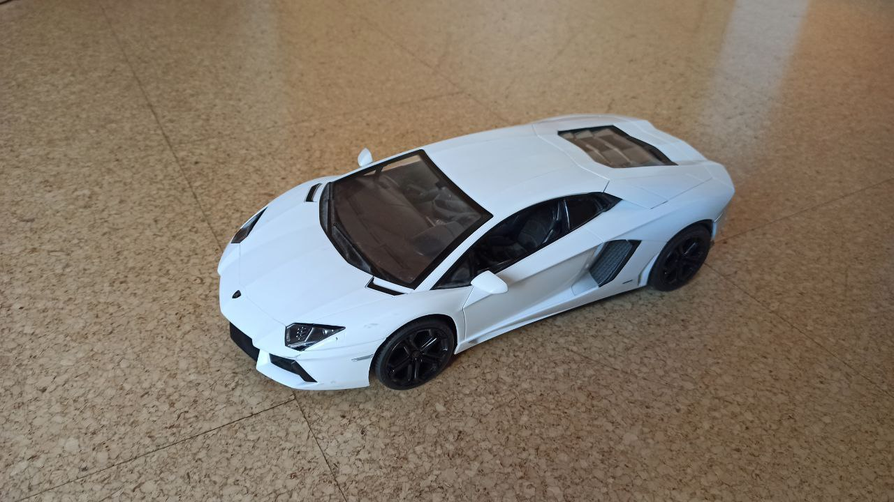

- [rospCar](#rospcar)
- [Work progression](#work-progression)
  - [1. Old System](#1-old-system)
  - [2. Planning](#2-planning)
  - [3. ESP-32](#3-esp-32)
  - [4. Brain](#4-brain)
- [Resume](#resume)

# rospCar

This repository contains the whole redevelopment of an old RC car.

To change the control system to an esp32 and a ROS communication with the computer to potentially implement a SLAM algorithm.

# Work progression

I structured my work in the following four steps. Those are shortly discussed on this page for more detailed information on each step please correspond to each designated page.

## 1. [Old System](oldSystem/)

The first step of the redevelopment process consists of understanding and checking the currently used electronics. As well as their functionality.

## 2. [Planning](upgradePlan/)

In the second phase, I chose the requirements for the new car, ordered parts that fulfill those requirements as well as designed the new circuit diagram.

## 3. [ESP-32](esp/)

The third step is considered the heart of the hardware development process. Here I define the functional requirements for the esp-32 and implement those decently.

## 4. [Brain](brain/)

Last but not least I design the other side of the communication and control algorithm for this project on the computer. The computer software is calculating the movements of the car and is using the sensor data to do this. Furthermore, it will be using a SLAM algorithm to map the whole area and it will be possible to go to certain locations easily.

# Resume
