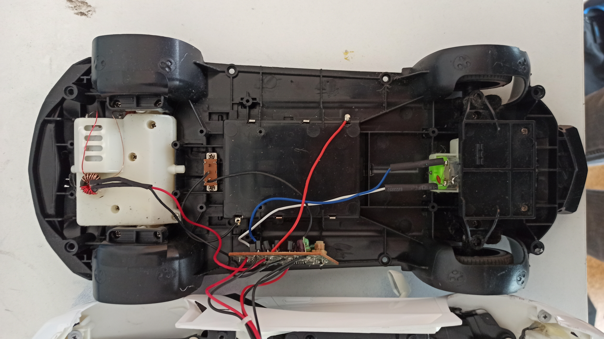
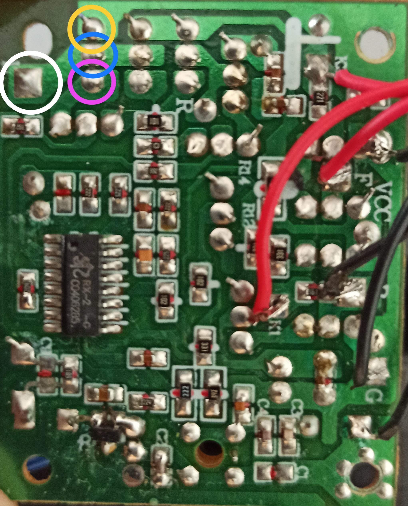
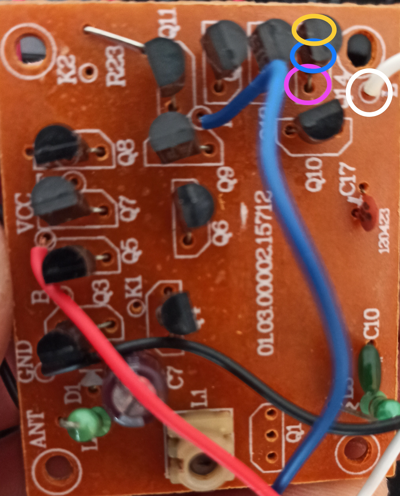
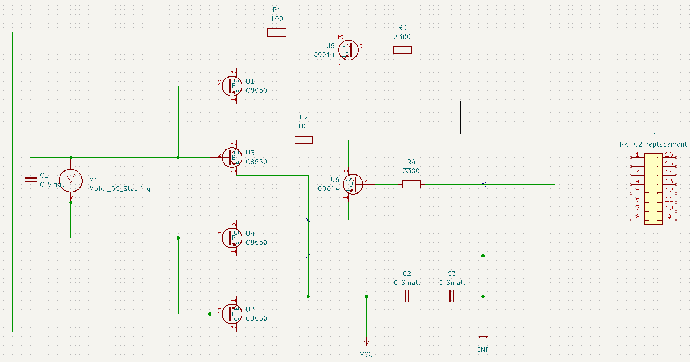

- [1. Old System](#1-old-system)
  - [1.1 Components](#11-components)
  - [1.2 Schematic](#12-schematic)
  - [1.3 Testing](#13-testing)
    - [1.3.1 FA-130](#131-fa-130)
    - [1.3.2 260s-18130-38](#132-260s-18130-38)

# 1. Old System

I opened the car cover to reveal the internal structure of the RC car. 
 
As can be seen, the car's internals is pretty basic.

## 1.1 Components

- 1x FA-130 motor (steering)
- 1x 260s-18130-38 motor (impulsion)
- 1x RX-2C (controller)
- 1x PCB
- 2x C8050 (transistor)
- 2x C8550 (transistor)
- 2x D882 (transistor)
- 2x B772 (transistor)
- 4x C9014 (transistor)
- LEDs
- cable
- batterie department
- resistors 
- capacitors
- wires
- power switch

## 1.2 Schematic

To understand the control system of the RC car I partially analyzed the PCB and drama and created a [circuit diagram](initialSystem/) in kicad based on those observations. 

 
Here is the partial circuit diagram as an image. 

However, I am a bit confused because the motor is connected to the middle part of all 4 transistors which is normally used to control the current running through the transistor. So I am not sure if I made an error creating the schematic based on the PCB or if there is some other information that I am missing.
So if anyone has an explanation for this I am more than happy to communicate with you regarding this issue.

## 1.3 Testing

Because I want to partially keep the existing system I have to test the current motors for their function.
### 1.3.1 FA-130

This [motor](https://product.mabuchi-motor.com/detail.html?id=10) is responsible for the steering of the car. I tested if the motor is still functional and this is the case so I can keep it. 
This motor has an operation Voltage of 1.5-3.0V and a maximum stall current of 2.1 Ampere.

### 1.3.2 260s-18130-38
With those engravings, I couldn't locate the exact model however it is not moving with different voltages. This means I will have to find a motor replacement that is fitting into the motor mounting place.
