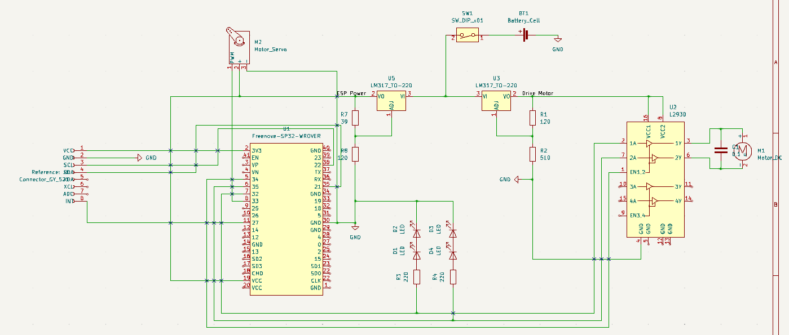
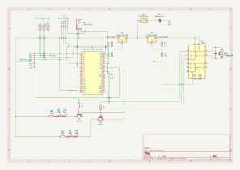

- [2. Planning](#2-planning)
  - [2.1 Funktional requiremnets](#21-funktional-requiremnets)
  - [2.2 Reqiered Hardware](#22-reqiered-hardware)
  - [2.3 Circuit Diagram](#23-circuit-diagram)

# 2. Planning
In this folder, I am planning the improvements for the rospCar inclusive of the new circuit diagram.

## 2.1 Funktional requiremnets

The rospCar has to fulfill multiple requirements.
 - steering
 - impulsion
 - controlling
 - voltage regulation
 - communication with another device via WIFI
 - environment tracking
 - front and back lights
 - similar appearance to the old system
 - speed information
## 2.2 Reqiered Hardware
To fulfill those requirements multiple hardware components are necessary.
- For steering, use a [SG90 Micro Servomotor](http://www.ee.ic.ac.uk/pcheung/teaching/DE1_EE/stores/sg90_datasheet.pdf). With such a motor the steering accuracy can be improved.
- The impulsion motor is defective so a new motor has to be inserted. For this, I bought a new [motor](https://www.luedeke-elektronic.de/DC-Kleinmotor-2-5V-6V-DC-210mA-14-500U-Min-MOT2.html) of a similar size.
- As a motor controllers, I am using two L9110H.
- To regulate the voltage going to the motor I am using the voltage regulator LM317T.
- Because the car should be able to communicate with another device using WIFI, I need a WIFI module. However, I want to use ROS2 as the communication system between those devices. This is a problem because on most really small microcontrollers it is not supported. I choose [micro-ROS](https://micro.ros.org/) which is capable of running on such small chips. But support for microcontrollers to communicate with WIFI is limited so I choose the [ESP-32](https://www.espressif.com/en/products/socs/esp32) as my main microcontroller.
- For environmental tracking there are multiple options:
  - <ins>Ultrasonic sensor:</ins> This is a cheap method to detect objects and their distance. However, I am not sure how accurate this tracking is gonna be and so it is a bad option for a SLAM algorithm. But I still wanna try it I bought the HC-SR04 as an ultrasonic sensor.
  - <ins>ToF sensor:</ins> Because ToF sensors can detect distances quite accurately it is a good option for a SLAM algorithm. However, it has to be kept in mind that transparent objects could not be detected. Another disadvantage of those sensors is that it only detects objects at the same height as the sensor. Even though I decided I want to use such a sensor. So I bought the VL53L0/1XV2 and will try to use those.
  - <ins>Camera:</ins> A camera would be good to get colors of the surroundings as well as a huge part of it. Because of the lens. I am currently not sure if I will be using a camera however if I want to add one I will be adding the 0V2640 camera to the ESP-32.
- The lights of the old system can still be used.
- The speed of the rospCar is detected with an accelerometer ITG/MPU6050/GY-521.
- For the electric circuit, I need a few resistors, capacitors and wires.
## 2.3 Circuit Diagram
### 2.3.1 V0.1
To test that the baisic functionality of driving and steering is working my circuit design does not include any environment sensors only the acceleration sensor, the motors and the LED's.

#### 2.3.1.1 Learnings
When building and implementing the first functionalitis I learned that I can't use the Pin's 34-39 for output signals. Also all Pins that have the ACD2 connected can't be used because of the needed Wifi. Those the relevant pins have to be rearanged.

Also the LED's can't be connected in this way so that has to be changed as well.

For a third optimization it might be neccessary to increase the voltage for the impulsion motor drive. However, it has to be keept in mind that that voltage is also powering the L293D those it should not be overvoltaged. It can also be considered to exchange the LM317 for another trasformer that is cappable of higher current.

### 2.3.2 V0.2
To fully implement and to consider all hardware limitations I am now adding a Ultarsonic and Time-of-Flight sensor to the system including some of the learnings from before.
